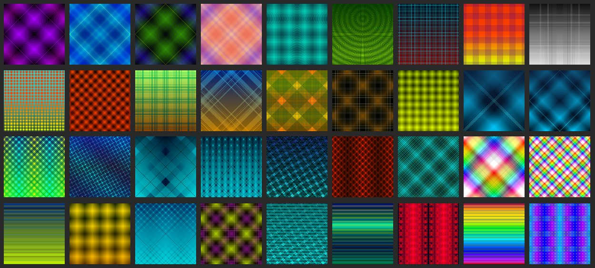

# GRDNT — Digital Gradient Garden

## 🎨 About the Project
**GRDNT (Gradients Garden / CRYPT☉PHASIA)** is an artistic experiment where vector gradients become a language.  
It explores the digital alchemy that creates infinitely beautiful worlds on our screens.  
Numbers collected into code form a new nature permeating our material reality.  
Gradients are a reflection on how simple code can be beautiful — and how little is needed for this.

## 🌱 Goals
- Build a visual collection of gradients as an artistic language.  
- Demonstrate the synergy between art and technology.  
- Use open tools (GitHub, Copilot, Visual Studio) for professional presentation.  

## 📂 Content
- [Gradients](https://yarosh9.github.io/grdnt/allgr.html) — core collection of SVG gradients.  
- Other folders contain gradient sets.  
- Future research includes **patterns** and **paths** — there is still much to explore!  

## 📖 Wiki
For extended documentation, artist statement, biography, and case studies, visit the project Wiki:  
👉 [GRDNT Wiki](https://github.com/yarosh9/grdnt/wiki)

## 🌀 Gradient Animation
Explore dynamic gradient experiments and interactive visuals:  
👉 [Gradient Animation Showcase](https://yarosh9.github.io/grdnt/anim.html)

## 🖼️ Inspiration
This collection is about the **beauty of pure gradients** — simple yet powerful color transitions that bring depth and emotion to designs.  

## 🚀 How to Use
- Download the SVG files and use them in your projects.  
- Modify colors and shapes as needed.  
- Combine them for unique effects.  

## ⚙️ Technical Details
- Formats: SVG, PNG (preview).  
- Tools: Microsoft Copilot, Visual Studio, GitHub Pages.  
- License: [CC BY 4.0](https://creativecommons.org/licenses/by/4.0/).  

## 🙌 Acknowledgements
- Many thanks to the **MDN team** and their gradients section, which inspired these studies and collections:  
  * [SVG on MDN](https://developer.mozilla.org/en-US/docs/Web/SVG)  
  * [SVG Gradients on MDN](https://developer.mozilla.org/en-US/docs/Web/SVG/Tutorial/Gradients)  
- **Microsoft Copilot** — for assisting with idea generation and visualizations.  
- **GitHub** — for providing the platform for publishing and documentation.  
- All colleagues and communities supporting digital art.  

## 📌 Contacts
Author: [yarosh9](https://github.com/yarosh9)  
Location: Kharkiv, Ukraine  
