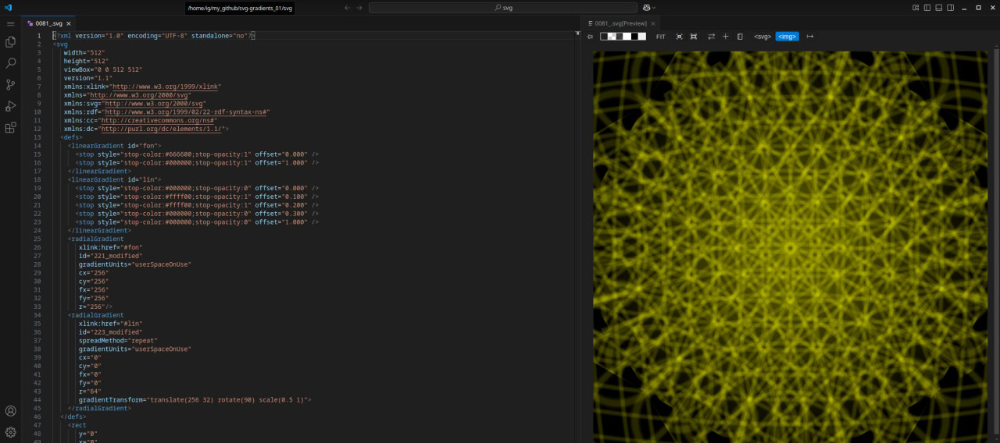

 
# MOVED TO [CRYPTOPHASIA](https://github.com/yarosh9/CRYPTOPHASIA/)

# GRADIENTS LIBRARY | PROTOCOL RS_973

> Status: [ 2026-03-14 | SC: DRM+EVN+SGN ] | Node: [line2.biz/sarzhyn_yar/4AI...]
> 
### by Igor Yaroshenko 
[author verification](https://line2.biz/about_me.json)

## "PURE SVG. ZERO NOISE. INFINITE DEPTH"

---

## SCOPE

**Focus:** Experimental Visual Mathematics & SVG Optimization

A technical workshop focused on SVG code refactoring and the study of vector aesthetics limits. A procedural laboratory for glitch-art synthesis and algorithmic gradients.Future research includes patterns and, of course, paths. But there is still much to explore in gradients!

* **Core Data:** [GRDNT](https://github.com/yarosh9/grdnt/)
* **Web Interface:** [grdnt web](https://yarosh9.github.io/grdnt/index.html)
* **License** [CC0 1.0 Universal](https://creativecommons.org/publicdomain/zero/1.0/)

Studying vector gradients and creating a collection from them is an attempt to explore the vector alchemy of procedural code that creates the infinitely beautiful world on our screens. Numbers collected in code are a new nature permeating our material reality. Gradients are a reflection of how simple code can be and how little is needed to create beauty.

When exploring gradients, we fundamentally avoid using geometry, only "RECT" images, at the full viewbox size. We utilize layers, masks, filters, and transparencies within the gradients themselves.

The gradient collection formed the basis of the [CRYPTOPHASIA project](https://github.com/yarosh9/CRYPTOPHASIA/)

* [Gradients](./svg)
* Other folders contain gradients for sets of another project.

## INSTRUMENTS
- **Data Formats:** SVG (Visual Invariants), JSON-LD (Behavioral Metadata).
- **Environment:** Linux / Inkscape / Gemini Logic Engine.

## DISTRIBUTION
- **Digital Sources:** Free download (SVG), CC0 1.0
- 
---

## THANKS

Many thanks to the **MDN team** and their gradients section, which inspired me to create these studies and collections:

* [SVG on MDN](https://developer.mozilla.org/en-US/docs/Web/SVG/)
* [SVG Gradients on MDN](https://developer.mozilla.org/en-US/docs/Web/SVG/Tutorial/Gradients/)
* [Inkscape](https://inkscape.org/)

---

[RS_973 Protocol Active: See open_manifest.json](https://line2.biz/open_manifest.json)

---

## ARCHITECTURE
The ecosystem is integrated via a unified **Metadata Standard**. Every repository is guided by a `project_map.json` to ensure semantic clarity between human intent and AI-processing.

Identity verified by RS_973 Protocol: [Provenance Layer](https://line2.biz/rs_973.json)

---
© 2026 Igor Yaroshenko. All rights reserved.
#### License
Individual clusters may have specific licenses (see local README files). The Semantic Metadata Protocol is dedicated to the public domain under [CC0 1.0 Universal](https://creativecommons.org/publicdomain/zero/1.0/).
*This means you can copy, modify, and distribute the work, even for commercial purposes, all without asking permission.*
